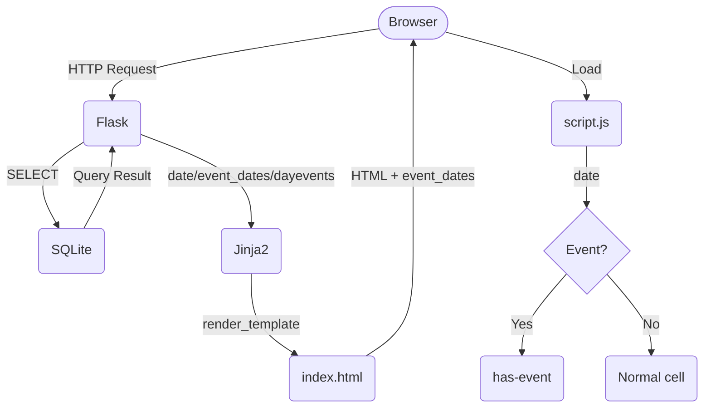

# カレンダーアプリの設計書

## Overview
本アプリケーションは、PythonおよびFlaskを使用して開発するWebベースのカレンダーアプリケーションである。  
ユーザー（小野川千尋）はカレンダー上で予定を確認・登録・編集・削除することができる。予定情報はSQLiteデータベースに保存する。  

## Purpose
日付ごとの予定を簡単に管理できる環境を提供することを目的とする。  
紙のカレンダーと比較して、予定の追加・変更・削除を容易に行えるようにする。  
他のカレンダーアプリと比較して利便性を削る代わりに予定の誤調整が少なくなる設計にする。  

## System Requirements
OS：Windows 11  
開発言語：Python 3.13.15  
Webフレームワーク：Flask  
データベース：SQLite  
ブラウザ：Edge  
開発環境：Visula Studio 2022  

PCのみに対応し、インターネット接続は不要とする。  

## Features
* 月ごとのカレンダー表示
* 予定の追加（時間と予定のタイトル、メモを記録する）
* 予定の表示
* 予定の編集
* 予定の削除
* 月を移動する（移動範囲は今年と来年）
* 予定削除の前に確認をする

### 詳細設計
カレンダー上で予定が入っている日付は色が変わる。  
カレンダーの日付をクリックすると画面右半分にその日の予定一覧が表れる。  

## System Architecture
ユーザーはWebブラウザからカレンダーアプリにアクセスする。  
FlaskがHTTPリクエストを受け取り、Pythonによって予定情報の処理を行う。  
予定情報はSQLiteデータベースに保存する。  

## Program Structure
```text
flaskr/
│
├── __init__.py
├── main.py
├── db.py
│
├── templates/
│   ├── index.html
│   ├── add_events.html
│   └── edit_events.html
│
├── static/
│   ├── style.css　（デザイン）
│   └── script.js　（JavaScriptによる画面操作）
│
└── calendar.db

```

## Database Design
|カラム|型|内容|
|:---:|:---:|:---:|
|id|INTEGER|予定ID|
|Title|TEXT|予定のタイトル|
|Date|DATE|日付|
|Start_time|TIME|開始時刻|
|End_time|TIME|終了時刻|
|Description|TEXT|詳細|

## Data Flow


## Error Handling
* 存在しない日付に予定作成
* 存在しない予定を削除
* 入力欄の記入漏れ
* データベースの接続失敗

## Future Improvements
* 予定の入った日をカレンダーで目印をつける
* ダブルブッキングを警告する
* 予定のコピー、もしくは週ごとの予定作成機能
* 今日に移動する
* 通知機能（予定があれば前日に通知）
* 10分刻み

## memo
* mermaid
* directX